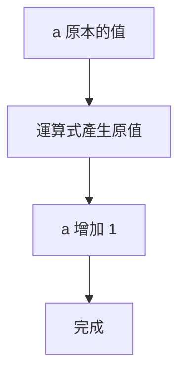
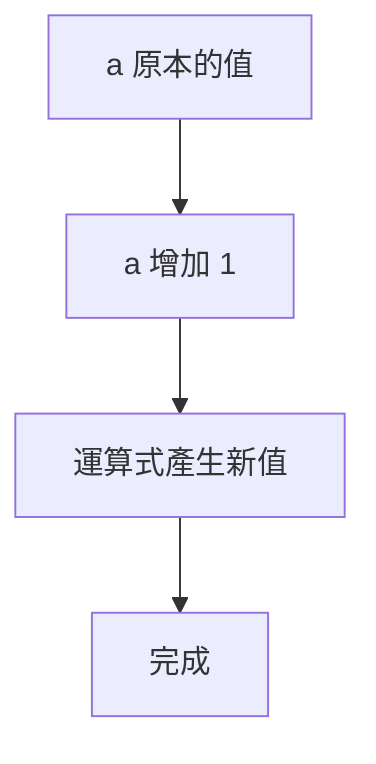
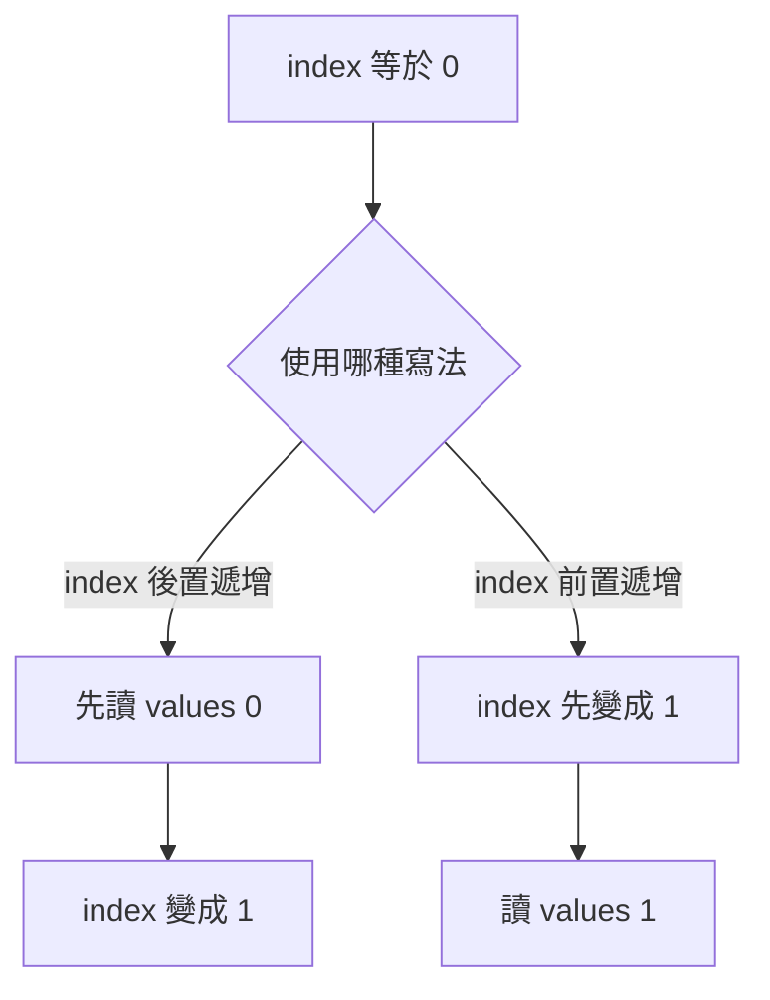
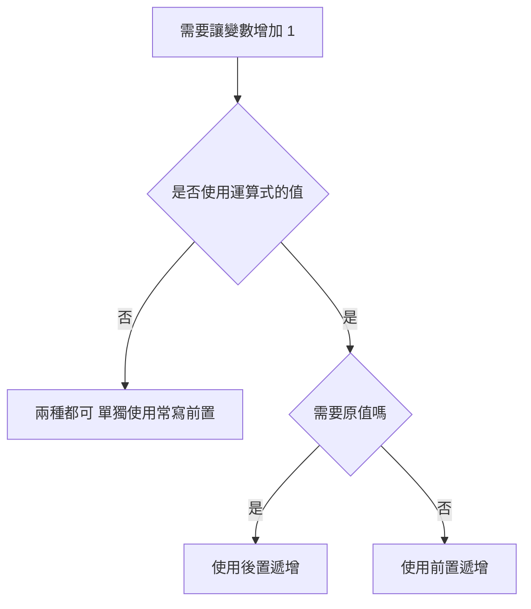

# `a++` 與 `++a`：後置遞增與前置遞增

> 本章重點：`a++` 與 `++a` 都會讓 `a` 增加 1，但它們在運算式中產生的值不同。

---

## 1. 最重要的結論

假設：

```cpp
int a = 5;
```

### `a++`：後置遞增

```text
先使用 a 原本的值
再把 a 增加 1
```

### `++a`：前置遞增

```text
先把 a 增加 1
再使用增加後的值
```

---

## 2. 快速比較表

| 寫法 | 名稱 | 運算式產生的值 | 執行後 `a` |
| --- | --- | ---: | ---: |
| `a++` | 後置遞增 | 原本的值 | 原值加 1 |
| `++a` | 前置遞增 | 增加後的值 | 原值加 1 |
| `a--` | 後置遞減 | 原本的值 | 原值減 1 |
| `--a` | 前置遞減 | 減少後的值 | 原值減 1 |

---

# Part A：單獨使用

## 3. 單獨一行時效果相同

```cpp
// VALIDATE
#include <iostream>
using namespace std;

int main() {
    int first = 5;
    int second = 5;

    first++;
    ++second;

    cout << first
         << " "
         << second
         << '\n';

    return 0;
}
```

輸出：

```text
6 6
```

因此，若遞增運算子單獨使用，對整數而言：

```cpp
a++;
```

和：

```cpp
++a;
```

最後都只是讓 `a` 增加 1。

---

# Part B：放在指定運算中

## 4. `x = a++`

```cpp
int a = 5;
int x = a++;
```

概念上相當於：

```cpp
int x = a;
a = a + 1;
```

結果：

```text
x = 5
a = 6
```

---

## 5. 完整後置遞增範例

```cpp
// VALIDATE
#include <iostream>
using namespace std;

int main() {
    int a = 5;

    const int x =
        a++;

    cout << "x = "
         << x
         << '\n';

    cout << "a = "
         << a
         << '\n';

    return 0;
}
```

輸出：

```text
x = 5
a = 6
```

---

## 6. `x = ++a`

```cpp
int a = 5;
int x = ++a;
```

概念上相當於：

```cpp
a = a + 1;
int x = a;
```

結果：

```text
a = 6
x = 6
```

---

## 7. 完整前置遞增範例

```cpp
// VALIDATE
#include <iostream>
using namespace std;

int main() {
    int a = 5;

    const int x =
        ++a;

    cout << "x = "
         << x
         << '\n';

    cout << "a = "
         << a
         << '\n';

    return 0;
}
```

輸出：

```text
x = 6
a = 6
```

---

# Part C：逐步追蹤

## 8. `a++` 的順序

```cpp
int a = 5;
int result = a++;
```

流程：

```text
第 1 步：讀取 a 原本的值 5
第 2 步：把 5 指定給 result
第 3 步：把 a 增加為 6
```

---

## 9. `++a` 的順序

```cpp
int a = 5;
int result = ++a;
```

流程：

```text
第 1 步：把 a 增加為 6
第 2 步：讀取增加後的值 6
第 3 步：把 6 指定給 result
```

---

## 10. 視覺化

```text
a++：

a 原本是 5
    │
    ├── 運算式先產生 5
    └── a 再變成 6


++a：

a 原本是 5
    │
    ├── a 先變成 6
    └── 運算式產生 6
```

---

# Part D：輸出中的差異

## 11. `cout << a++`

```cpp
// VALIDATE
#include <iostream>
using namespace std;

int main() {
    int a = 5;

    cout << a++
         << '\n';

    cout << a
         << '\n';

    return 0;
}
```

輸出：

```text
5
6
```

---

## 12. `cout << ++a`

```cpp
// VALIDATE
#include <iostream>
using namespace std;

int main() {
    int a = 5;

    cout << ++a
         << '\n';

    cout << a
         << '\n';

    return 0;
}
```

輸出：

```text
6
6
```

---

# Part E：陣列索引

## 13. `values[index++]`

意思：

```text
先使用目前的 index
再讓 index 增加 1
```

```cpp
// VALIDATE
#include <array>
#include <cstddef>
#include <iostream>
using namespace std;

int main() {
    const array<int, 3> values{
        10,
        20,
        30
    };

    size_t index = 0;

    const int value =
        values[index++];

    cout << value
         << " "
         << index
         << '\n';

    return 0;
}
```

輸出：

```text
10 1
```

---

## 14. `values[++index]`

意思：

```text
先讓 index 增加 1
再使用新的 index
```

```cpp
// VALIDATE
#include <array>
#include <cstddef>
#include <iostream>
using namespace std;

int main() {
    const array<int, 3> values{
        10,
        20,
        30
    };

    size_t index = 0;

    const int value =
        values[++index];

    cout << value
         << " "
         << index
         << '\n';

    return 0;
}
```

輸出：

```text
20 1
```

---

## 15. 索引比較

一開始：

```cpp
size_t index = 0;
```

### 後置

```cpp
values[index++];
```

使用：

```text
values[0]
```

之後：

```text
index = 1
```

### 前置

```cpp
values[++index];
```

先變成：

```text
index = 1
```

再使用：

```text
values[1]
```


---

# Part F：迴圈中的用法

## 16. 傳統 `for` 迴圈

```cpp
// VALIDATE
#include <iostream>
using namespace std;

int main() {
    for (
        int index = 0;
        index < 5;
        ++index
    ) {
        cout << index
             << " ";
    }

    cout << '\n';

    return 0;
}
```

輸出：

```text
0 1 2 3 4
```

若把：

```cpp
++index
```

改成：

```cpp
index++
```

對整數而言，迴圈結果相同。

---

## 17. 為什麼 C++ 常偏好 `++index`？

對內建整數，現代 compiler 通常會把：

```cpp
index++;
```

和：

```cpp
++index;
```

編譯成同樣有效率的程式。

但對某些 iterator 或自訂類別，後置版本在語意上可能需要保存舊值，前置版本只修改目前物件。

因此常見寫法是：

```cpp
++iterator;
```

不過，可讀性與正確性比微小效能差異更重要。

---

# Part G：遞減運算子

## 18. `a--`

後置遞減：

```text
先使用原值
再減少 1
```

## 19. `--a`

前置遞減：

```text
先減少 1
再使用新值
```

---

## 20. 完整遞減範例

```cpp
// VALIDATE
#include <iostream>
using namespace std;

int main() {
    int first = 5;
    int second = 5;

    const int x =
        first--;

    const int y =
        --second;

    cout << x
         << " "
         << first
         << '\n';

    cout << y
         << " "
         << second
         << '\n';

    return 0;
}
```

輸出：

```text
5 4
4 4
```

---

# Part H：避免複雜副作用

## 21. 不要在同一運算式中多次修改同一變數

避免：

```cpp
/* int result =
    a++ +
    ++a; */
```

避免：

```cpp
/* function(
    a++,
    ++a
); */
```

這些寫法：

- 難以閱讀。
- 容易誤判執行順序。
- 某些形式可能涉及未定義或不易攜帶的行為。
- 容易產生難以重現的錯誤。

---

## 22. 拆成清楚步驟

與其寫：

```cpp
result =
    values[index++];
```

初學時可寫成：

```cpp
result =
    values[index];

++index;
```

兩行更容易追蹤，也更容易設定 breakpoint。

---

# Part I：常見使用情境

## 23. 讀取目前元素後前進

```cpp
const int value =
    values[index];

++index;
```

可簡寫為：

```cpp
const int value =
    values[index++];
```

---

## 24. 先前進再讀取

```cpp
++index;

const int value =
    values[index];
```

可簡寫為：

```cpp
const int value =
    values[++index];
```

使用前必須確認新 index 沒有超出範圍。

---

## 25. 計數器

```cpp
if (value > 0) {
    ++positiveCount;
}
```

因為不需要遞增運算式產生的值，使用前置版本清楚且常見。

---

# Part J：完整比較程式

## 26. 四種運算比較

```cpp
// VALIDATE
#include <iostream>
using namespace std;

int main() {
    int first = 5;
    int second = 5;
    int third = 5;
    int fourth = 5;

    const int postIncrement =
        first++;

    const int preIncrement =
        ++second;

    const int postDecrement =
        third--;

    const int preDecrement =
        --fourth;

    cout << "first++ gives "
         << postIncrement
         << ", first becomes "
         << first
         << '\n';

    cout << "++second gives "
         << preIncrement
         << ", second becomes "
         << second
         << '\n';

    cout << "third-- gives "
         << postDecrement
         << ", third becomes "
         << third
         << '\n';

    cout << "--fourth gives "
         << preDecrement
         << ", fourth becomes "
         << fourth
         << '\n';

    return 0;
}
```

---

# Part K：追蹤表

## 27. 範例

```cpp
int a = 3;
int x = a++;
int y = ++a;
```

| 步驟 | `a` | `x` | `y` |
| --- | ---: | ---: | ---: |
| 初始化 | 3 | 尚未建立 | 尚未建立 |
| `x = a++` | 4 | 3 | 尚未建立 |
| `y = ++a` | 5 | 3 | 5 |

---

# Part L：概念檢查

## 28. 問題與答案

### Q1. `a++` 和 `++a` 都會做什麼？

<details><summary>查看答案</summary>

都會讓 `a` 增加 1。

</details>

### Q2. `a++` 產生舊值還是新值？

<details><summary>查看答案</summary>

舊值。

</details>

### Q3. `++a` 產生舊值還是新值？

<details><summary>查看答案</summary>

新值。

</details>

### Q4. 單獨一行時，`a++` 與 `++a` 最後結果是否相同？

<details><summary>查看答案</summary>

對一般整數而言相同，都讓 `a` 增加 1。

</details>

### Q5. 一開始 `a = 5`，執行 `x = a++` 後結果？

<details><summary>查看答案</summary>

`x = 5`，`a = 6`。

</details>

### Q6. 一開始 `a = 5`，執行 `x = ++a` 後結果？

<details><summary>查看答案</summary>

`x = 6`，`a = 6`。

</details>

### Q7. `values[index++]` 使用哪個 index？

<details><summary>查看答案</summary>

先使用舊 index，再讓 index 增加 1。

</details>

### Q8. `values[++index]` 使用哪個 index？

<details><summary>查看答案</summary>

先增加 index，再使用新 index。

</details>

### Q9. `a--` 的意思？

<details><summary>查看答案</summary>

先產生原值，再讓 `a` 減少 1。

</details>

### Q10. 是否應在同一複雜運算式中多次修改 `a`？

<details><summary>查看答案</summary>

不應。應拆成多個清楚的 statement。

</details>

---

# Part M：程式閱讀練習

## 29. 預測輸出

### 題目 1

```cpp
int a = 5;
cout << a++;
```

<details><summary>查看答案</summary>

輸出 `5`，之後 `a` 變成 6。

</details>

### 題目 2

```cpp
int a = 5;
cout << ++a;
```

<details><summary>查看答案</summary>

輸出 `6`。

</details>

### 題目 3

```cpp
int a = 2;
int x = a++;
cout << a << " " << x;
```

<details><summary>查看答案</summary>

```text
3 2
```

</details>

### 題目 4

```cpp
int a = 2;
int x = ++a;
cout << a << " " << x;
```

<details><summary>查看答案</summary>

```text
3 3
```

</details>

### 題目 5

```cpp
int a = 10;
a++;
++a;
cout << a;
```

<details><summary>查看答案</summary>

```text
12
```

</details>

### 題目 6

```cpp
int a = 4;
int x = a--;
cout << x << " " << a;
```

<details><summary>查看答案</summary>

```text
4 3
```

</details>

### 題目 7

```cpp
int a = 4;
int x = --a;
cout << x << " " << a;
```

<details><summary>查看答案</summary>

```text
3 3
```

</details>

### 題目 8

```cpp
array<int, 3> values{
    10,
    20,
    30
};

size_t index = 0;

cout << values[index++];
```

<details><summary>查看答案</summary>

輸出 `10`，之後 `index = 1`。

</details>

### 題目 9

```cpp
array<int, 3> values{
    10,
    20,
    30
};

size_t index = 0;

cout << values[++index];
```

<details><summary>查看答案</summary>

輸出 `20`，此時 `index = 1`。

</details>

### 題目 10

```cpp
for (
    int index = 0;
    index < 3;
    ++index
) {
    cout << index;
}
```

<details><summary>查看答案</summary>

```text
012
```

</details>


---

# Part N：實作練習

## 30. 練習題

### TODO 1

建立 `a = 7`，使用後置遞增指定給 `x`，輸出 `a` 與 `x`。

### TODO 2

建立 `a = 7`，使用前置遞增指定給 `x`，輸出 `a` 與 `x`。

### TODO 3

分別使用 `a--` 與 `--a`，比較結果。

### TODO 4

使用 `index++` 依序讀取陣列前三個元素。

### TODO 5

把：

```cpp
result =
    values[index++];
```

改寫成兩行、不使用後置遞增的版本。

### TODO 6

寫一個 `for` 迴圈，使用 `++index` 輸出 1 到 10。

### TODO 7

建立追蹤表，分析：

```cpp
int a = 1;
int x = a++;
int y = ++a;
int z = a--;
```

### TODO 8

找出並改寫一個在同一運算式中多次修改同一變數的危險寫法。

---

# Part O：常見錯誤

## 31. 常見錯誤提醒

1. 認為 `a++` 不會改變 `a`。
2. 認為 `a++` 會立即產生新值。
3. 認為 `++a` 產生原值。
4. 忘記 `a++` 最後仍會讓 `a` 增加。
5. 在陣列索引中混淆舊 index 與新 index。
6. 在一個複雜運算式中多次修改同一變數。
7. 為了少寫一行而犧牲可讀性。
8. 在沒有檢查範圍時使用 `values[++index]`。
9. 把 `a++` 誤寫成 `a + +`。
10. 在條件式中使用遞增，卻沒有理解副作用。
11. 在 function arguments 中多次修改同一變數。
12. Debug 時不逐步追蹤變數值。
13. 只背「先用後加」，卻不會套用到指定與索引。
14. 誤認 `index++` 與 `++index` 在所有自訂型別上成本完全相同。
15. 將過度複雜的一行程式視為更好的寫法。

---

# Part P：Mermaid 圖解

## 32. `a++`



## 33. `++a`



## 34. 陣列索引



## 35. 選擇寫法



---

# 本章完成標準

完成本章後，你應該能做到：

1. 解釋 `a++`。
2. 解釋 `++a`。
3. 區分前置與後置遞增。
4. 說明兩者單獨使用時的效果。
5. 預測 `x = a++`。
6. 預測 `x = ++a`。
7. 分析 `cout << a++`。
8. 分析 `cout << ++a`。
9. 分析 `values[index++]`。
10. 分析 `values[++index]`。
11. 在 `for` 迴圈使用遞增運算子。
12. 解釋 iterator 常偏好前置遞增的原因。
13. 解釋 `a--`。
14. 解釋 `--a`。
15. 使用追蹤表分析變數。
16. 將複雜遞增運算拆成清楚 statement。
17. 避免同一運算式多次修改變數。
18. 檢查陣列索引範圍。
19. 找出常見遞增錯誤。
20. 選擇可讀性最高的寫法。

---

# 隱藏答案區

> Answer hidden — try it first.

<details><summary>TODO 1 答案</summary>

```cpp
int a = 7;

const int x =
    a++;

cout << a
     << " "
     << x
     << '\n';
```

結果：

```text
8 7
```

</details>

<details><summary>TODO 2 答案</summary>

```cpp
int a = 7;

const int x =
    ++a;

cout << a
     << " "
     << x
     << '\n';
```

結果：

```text
8 8
```

</details>

<details><summary>TODO 3 答案</summary>

若兩個變數都從 7 開始：

```cpp
int first = 7;
int second = 7;

const int x =
    first--;

const int y =
    --second;
```

結果：

```text
x = 7, first = 6
y = 6, second = 6
```

</details>

<details><summary>TODO 4 答案</summary>

```cpp
size_t index = 0;

cout << values[index++]
     << '\n';

cout << values[index++]
     << '\n';

cout << values[index++]
     << '\n';
```

</details>

<details><summary>TODO 5 答案</summary>

```cpp
result =
    values[index];

++index;
```

</details>

<details><summary>TODO 6 答案</summary>

```cpp
for (
    int index = 1;
    index <= 10;
    ++index
) {
    cout << index
         << " ";
}
```

</details>

<details><summary>TODO 7 答案</summary>

```text
初始：a = 1
x = a++：x = 1，a = 2
y = ++a：a = 3，y = 3
z = a--：z = 3，a = 2
```

</details>

<details><summary>TODO 8 答案</summary>

不要：

```cpp
/* int result =
    a++ +
    ++a; */
```

應拆成多個清楚步驟，並重新確認真正需要的計算順序。

</details>
